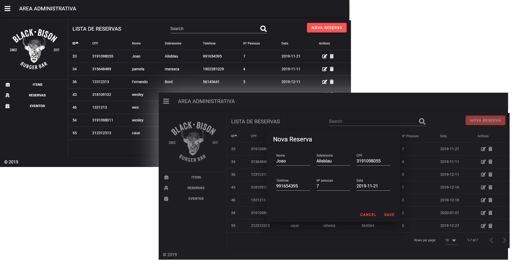
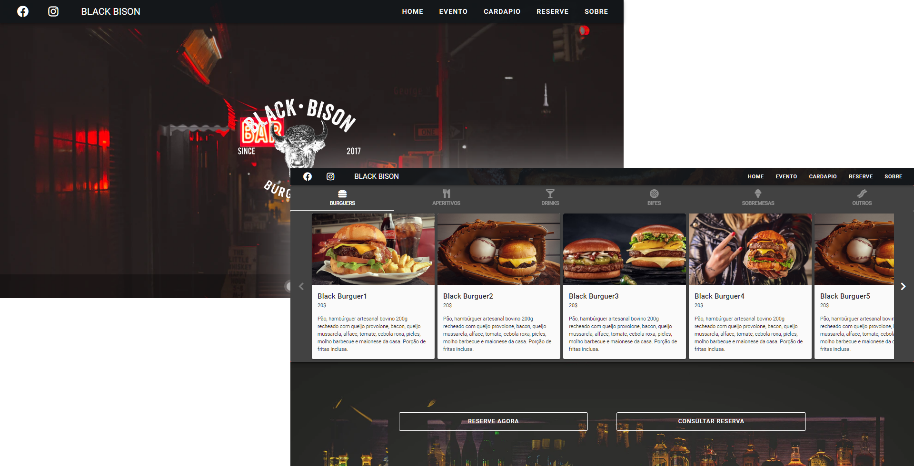

<h1 align="center">
    
</h1>

<p align="center">
  

  
  
  <a href="https://github.com/WesleyMarquesGit/Ecoleta/commits/master">
    
  </a>

  
   <a href="https://github.com/WesleyMarquesGit/Ecoleta/stargazers">
    
  </a>
</p>

### :rocket: Sobre o projeto

Este projeto foi criado no intuito de listar produtos e eventos de um pub, assim como permitir aos clientes autonomia em suas reservas.

Documentação: [Link][documentacao]

---

### 🎨 Interface

- #### Admin

<h1 align="center">
  
</h1>

- #### Cliente
<h1 align="center">
  
</h1>

---

### :space_invader: Tecnologias

As seguintes ferramentas foram usadas na construção do projeto:

- [Node.js][nodejs]
- [Vue.js][vuejs]
- [Vuetify][vuetify]
- [Nodemon][nodemon]
- [Sqlite3][sqlite3]

---

### :computer: Manual para execução

#### Pré-requisitos

- É **necessário** possuir o **[Node.js](https://nodejs.org/en/)** instalado no computador
- É **necessário** possuir o **[Git](https://git-scm.com/)** instalado e configurado no computador
- Também, é **preciso** ter um gerenciador de pacotes seja o **[NPM](https://www.npmjs.com/)** ou **[Yarn](https://yarnpkg.com/)**.

#### Como executar

```bash
Podemos considerar este projeto como sendo divido em três partes:

1. Back End (pasta api)
2. Administrativo (pasta admin)
3. Cliente (pasta cliente)

Tanto a pagina administrativo quanto a cliente precisam que a api esteja sendo executada para funcionar.
```

#### 1. Clone o repositório

```bash
# Clone este repositório
$ git clone https://github.com/WesleyMarquesGit/BlackBison.git
```

#### 2. Rodando o servidor (Api)

```bash
# Acesse a pasta do projeto no terminal/cmd
$ cd api

# Instale as dependências
$ npm i

# Execute a aplicação em modo de desenvolvimento
$ npm run dev

# O servidor inciará na porta:3000 - acesse http://localhost:3000
```

#### 3. Rodando o cliente e admin

```bash
# Acesse a pasta do projeto no seu terminal/cmd
$ cd cliente ou cd admin

# Instale as dependências
$ npm i

# Execute a aplicação em modo de desenvolvimento
$ npm run serve

```

---

### Como contribuir para o projeto

```bash
# Faça um fork do projeto.

# Crie uma nova branch com as suas alterações
$ git checkout -b my-feature

# Salve as alterações e crie uma mensagem de commit contando o que você fez
$ git commit -m "feature: My new feature"

# Envie as suas alterações
$ git push origin my-feature
```

### Licença

```bash
Este projeto esta sobe a licença MIT.
```

### Social

<p align="left">
  
  <a href="mailto:wes.academico@gmail.com" target="_blank" >
    </a>

  <a href="https://www.linkedin.com/in/wesley-marques-profile/" target="_blank" >
    </a>
  
  <a href="https://www.facebook.com/wesley.marques.profile" target="_blank" >
    </a>
  
  <a href="https://api.whatsapp.com/send?phone=5553991654395" target="_blank" >
    </a>  
    
  <a href="https://www.instagram.com/weesmarques/" target="_blank" >
    </a>
</p>

---

[nodejs]: https://nodejs.org/
[vuejs]: https://vuetifyjs.com/en/getting-started/quick-start/
[vuetify]: https://vuejs.org/v2/guide/
[nodemon]: https://github.com/remy/nodemon#nodemon
[sqlite3]: https://www.sqlite.org/docs.html
[rs]: https://rocketseat.com.br
[documentacao]: https://drive.google.com/file/d/1VTzwhRiz5fAaJ63UQVNd6dqgxGdGFR0r/view?usp=sharing
